# TOC Project 2022
## LineBot


## 前言 :
2021年全年台股上漲3486.31點，如今已經站到萬八大關。比特幣也在2021四月中旬，站上65,000美元。因此作者認為，我們應該要跟上這個時代的腳步。因此想設計一個LinBot聊天機器人協助我們看台灣與國際股市。

## 構想
藉由`yahoo 股市`、`Coinbase` 與 `台灣證券交易所 Taiwan Stock Exchange(TWSE)`的公開資源，及時地顯示出股價以及K線。

用簡單的方式提供選項，另外也可以讓使用者自行手動輸入股票代碼，解決不同人的問題。

## Environment
* Python 3.8
* Windows Subsystem for Linux ( Ubuntu20.04 )
* Heroku
## Tech
* Web Crawling : 
  * 利用爬蟲的方式，抓取目前股價
* Deploy:
  * 透過雲端部屬的方式，建立伺服器，
## Functionality
* pandas
  * 利用爬進來的資料，畫出 K線，SMA(日均線)，並且自動上傳到雲端上，送到使用者的LINE上
* yfinance
  * 爬取美股的目前的交易情形
* TWSE Api
  * 爬取台股目前交易情形
## Finite State Machine
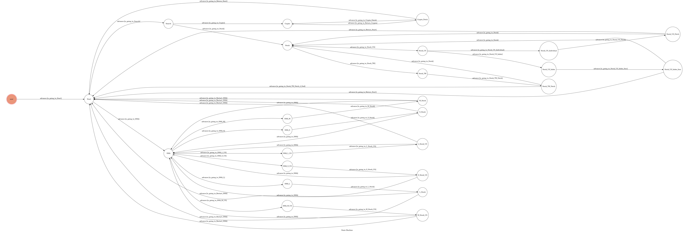
### State
1. `User` : 使用者一加入時，隨便輸入便可以開始使用相關功能
2. `Start`: 主選單，可以連結到兩大功能 `今日股市`、`近期股票分析`
3. `Search`: 選擇為`Crytro`或是`Stock`
4. `Crytro`: 跳出七種貨幣供使用者選擇(目前主流或作者熟識的幣種 `BTC`、`BAT`、`ETH`、`BNB`、`BTC`、`DOGE`、`SHIB`)
5. `Crytro_Fetch`: 爬取該虛擬貨幣的幣價，並以圖文方式呈現，且呈現出 `USD` 與 `TWD` 的價格，並以按鈕 `繼續搜尋` (search)與 `探索其他功能`(start)分別去不同地方
6. `Stock`: 可以連結到兩大股票位置 `台灣股市`、 `美國股市`
7. `Stock_TW`: 跳出多個常見股票供使用者選擇
   1. 若上述沒有使用者想要的幣種，可以文字輸入股票代號，以呈現出目前幣價。
   2. 呈現的常見股票是作者曾經或現在關注的股票
8. `Stock_TW_Fetch`: 爬取該股票的交易情形，並以圖文方式呈現。
   1. 且呈現出`目前的指數`，`上升或下降的比率`(以不同顏色表示)
      1. **作者使用的是台灣的表示法**，與美國的表示法略有不同
         1. 紅色：股價走揚
         2. 綠色：股價走低
         3. 灰色：與昨天收盤價相當，股價持平
   2. 並以按鈕 `繼續查詢`(search) 與 `離開`(start) 分別去不同地方
9. `Stock_US`: 可以連結到兩大美股常用功能 `美股大盤指數`、 `個別股市`
10. `Stock_Index` : 呈現出四種美股指數 `NASDAQ-100`、`NASDAQ`、`S&P 500標普500`、`Dow Jones工業指數`
11. `Stock_Indivisual`: 跳出多個常見股票供使用者選擇
    1. 若上述沒有使用者想要的股票，可以文字輸入股票代號，以呈現出目前幣價。
    2. 呈現的常見股票是作者曾經或現在關注的股票 (主要為NASDAQ中的科技概念股)
12. `Stock_US_Index_Four` : 呈現出目前的美國指數
13. `Stock_US_Fetch` : 呈現出目前的美國指數
    1. 且呈現出`目前的指數`，`上升或下降的比率`(以不同顏色表示)
    2. **作者使用的是台灣的表示法**，與美國的表示法略有不同
       1. 紅色：股價走揚
       2. 綠色：股價走低
       3. 灰色：與昨天收盤價相當，股價持平
    3. 並以按鈕 `繼續查詢`(search) 與 `離開`(start) 分別去不同地方
14. `SMA` : 呈現出`台股短線`、`美股短線`、`台股中線`、`美股中線`、`台股長線`、`美股長線`
    1. 以`我要分析`進入到不同的
15. `SMA_S`，`SMA_M`、`SMA_L`、`SMA_S_US`、`SMA_M_US`、`SMA_L_US`: 跳出多個常見股票供使用者選擇 
    1. 若上述沒有使用者想要的股票，可以文字輸入股票代號，以呈現出目前幣價。
    2. 呈現的常見股票是作者曾經或現在關注的股票
16. `S_Stock`，`M_Stock`，`L_Stock`，`S_Stock_US`，`M_Stock_US`，`L_Stock_US`：
    1. 爬取相對應的股票，並且運用資料分析，畫出圖之後，並且上傳到雲端上，再傳送到使用者的Line手機裡
###  模擬圖
1. 起始畫面
   1. 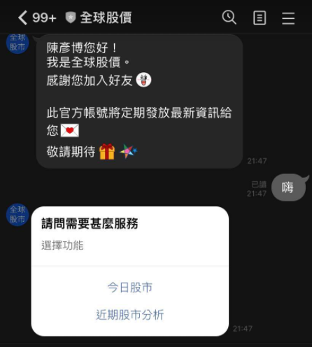
#### 第一大功能 (今日股市)
1. 虛擬貨幣
   1. 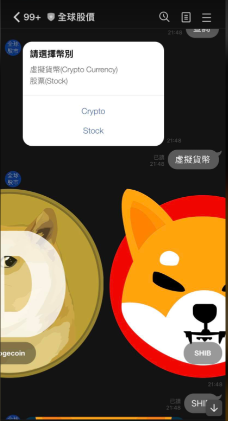
   2. 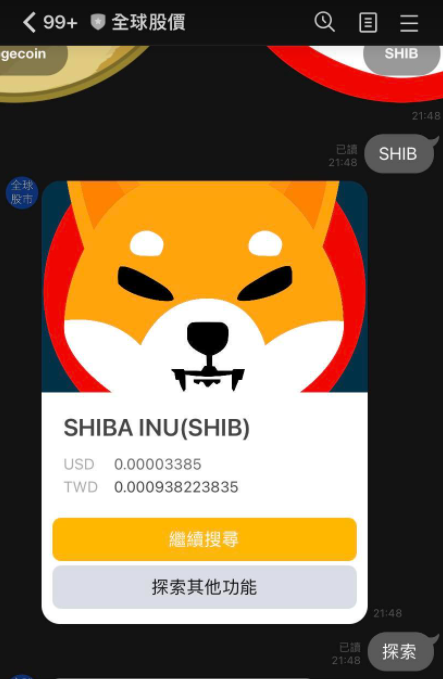
2. 台股
   1. 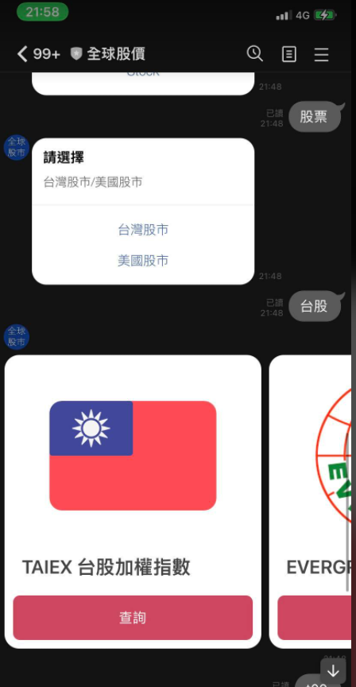
   2. 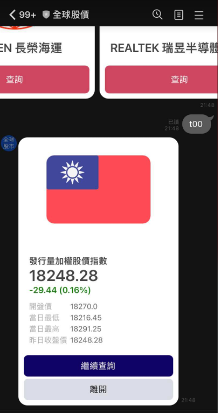 
3. 美股(指數)
   1. 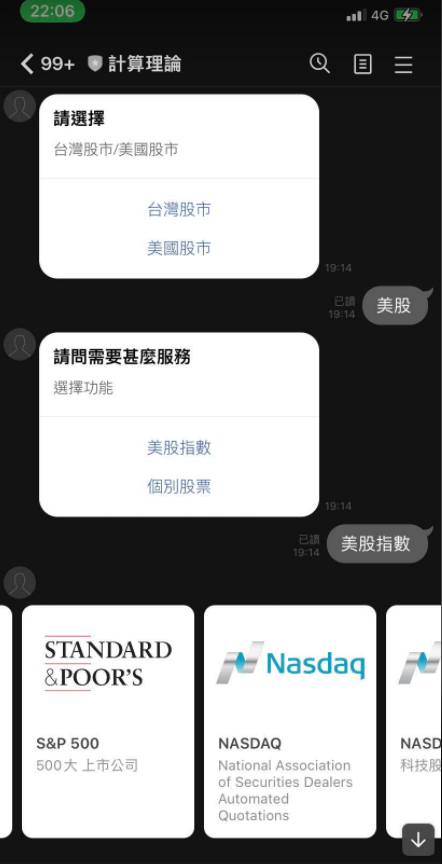
   2. 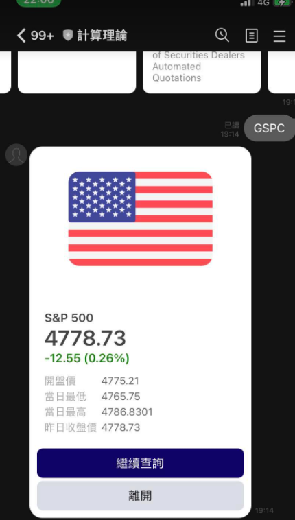
4. 美股(個別股)
   1. 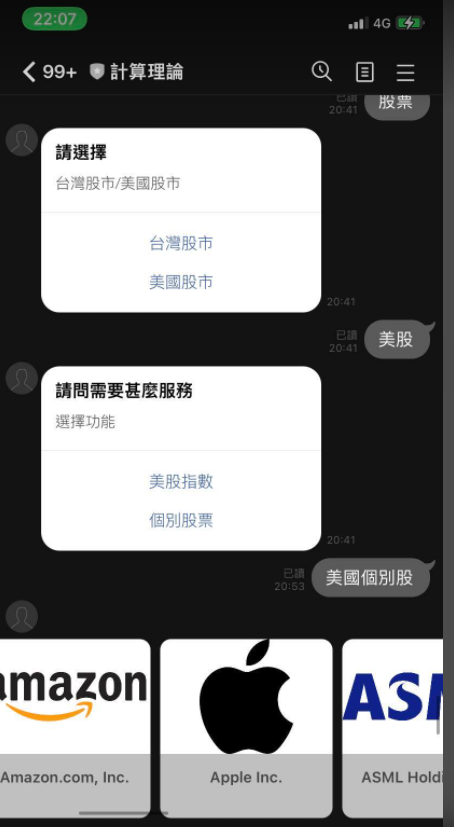
   2. 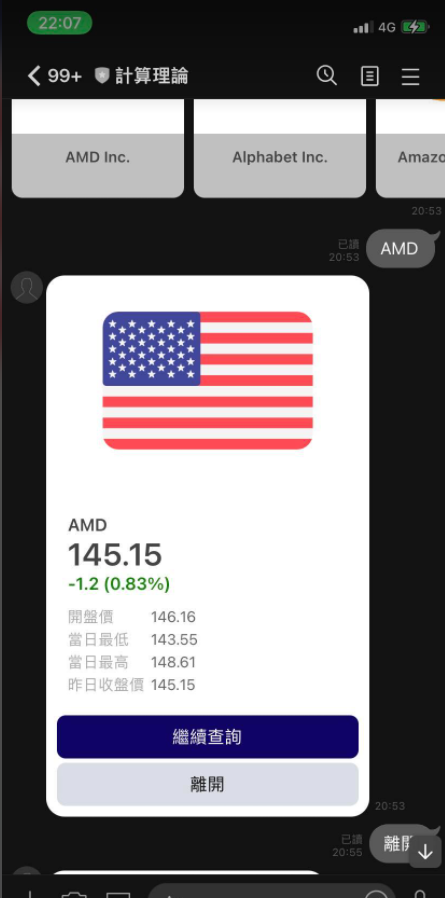
#### 第二大功能 ()
1. 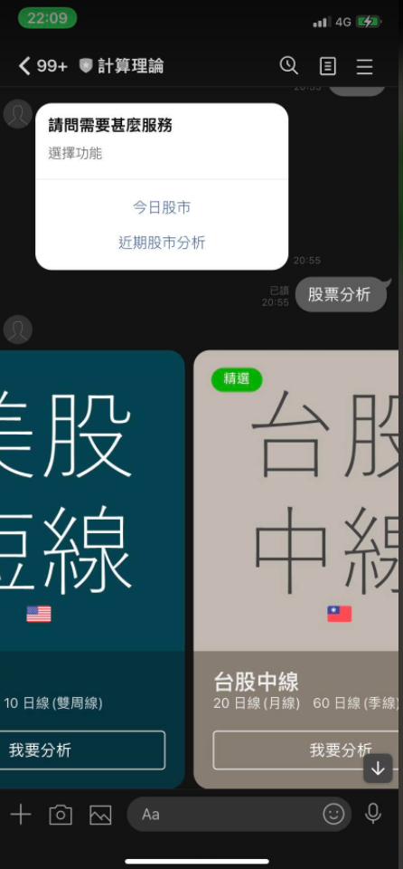
2. 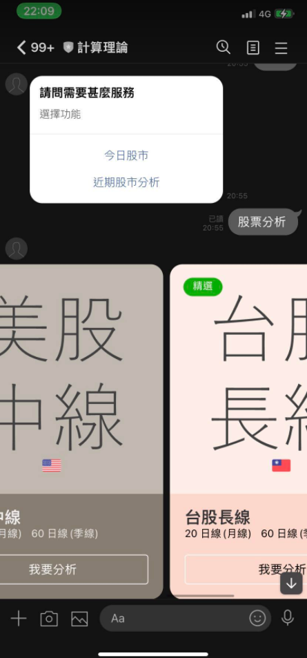
3. 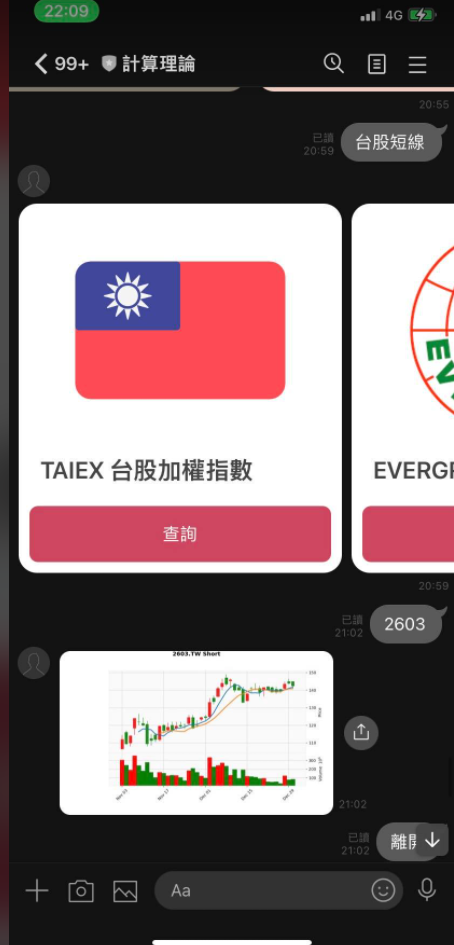
4. 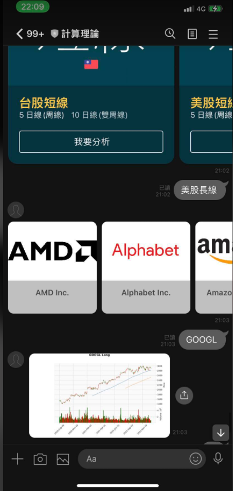

## Setup
### Prerequisite
* Python 3.8
* Pipenv

#### Install Dependency
```sh
pip3 install pipenv
pipenv --three
pipenv install
pipenv shell 
```
* pygraphviz (For visualizing Finite State Machine)
    * [Setup pygraphviz on Ubuntu](http://www.jianshu.com/p/a3da7ecc5303)
	* [Note: macOS Install error](https://github.com/pygraphviz/pygraphviz/issues/100)
	
#### Secret Data
You should generate a `.env` file to set Environment Variables refer to our `.env.sample`.
`LINE_CHANNEL_SECRET` and `LINE_CHANNEL_ACCESS_TOKEN` **MUST** be set to proper values.
Otherwise, you might not be able to run your code.

#### Run Locally
You can either setup https server or using `ngrok` as a proxy.

#### a. Ngrok installation
**`ngrok` would be used in the following instruction**
##### Linux
```sh
sudo apt-get install ngrok
```
#### Run the sever
```sh
python3 app.py
```
#### Run on other terminal
```sh
ngrok http 8000
```
After that, `ngrok` would generate a https URL.

## Deploy
Setting to deploy webhooks on Heroku.

### Heroku CLI installation
you can use Snap (Ubuntu 16+)
```sh
sudo snap install --classic heroku
```

### Connect to Heroku

1. Register Heroku: https://signup.heroku.com

2. Create Heroku project from website

3. CLI Login

	`heroku login`

### Upload project to Heroku

1. Add local project to Heroku project

	heroku git:remote -a {HEROKU_APP_NAME}

2. Upload project

	```
	git add .
	git commit -m "Add code"
	git push -f heroku master
	```

3. Set Environment - Line Messaging API Secret Keys

	```
	heroku config:set LINE_CHANNEL_SECRET=your_line_channel_secret
	heroku config:set LINE_CHANNEL_ACCESS_TOKEN=your_line_channel_access_token
	```

4. Your Project is now running on Heroku!

	url: `{HEROKU_APP_NAME}.herokuapp.com/callback`

	debug command: `heroku logs --tail --app {HEROKU_APP_NAME}`

5. If fail with `pygraphviz` install errors

	run commands below can solve the problems
	```
	heroku buildpacks:set heroku/python
	heroku buildpacks:add --index 1 heroku-community/apt
	```

	refference: https://hackmd.io/@ccw/B1Xw7E8kN?type=view#Q2-如何在-Heroku-使用-pygraphviz

## Reference
[Pipenv](https://medium.com/@chihsuan/pipenv-更簡單-更快速的-python-套件管理工具-135a47e504f4) ❤️ [@chihsuan](https://github.com/chihsuan)

[TOC-Project-2019](https://github.com/winonecheng/TOC-Project-2019) ❤️ [@winonecheng](https://github.com/winonecheng)

Flask Architecture ❤️ [@Sirius207](https://github.com/Sirius207)

[Line line-bot-sdk-python](https://github.com/line/line-bot-sdk-python/tree/master/examples/flask-echo)
